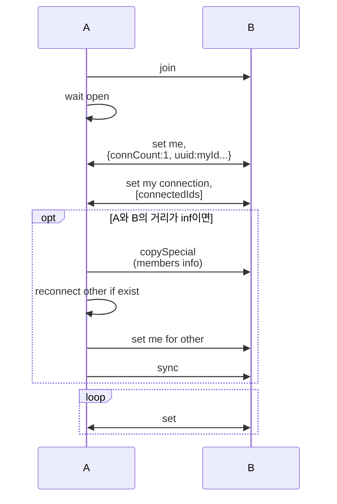
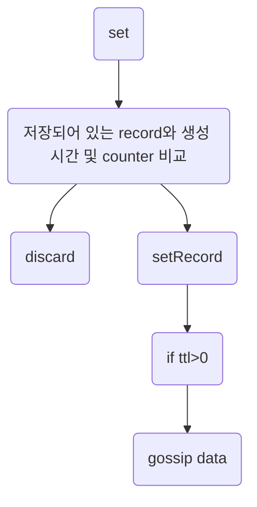
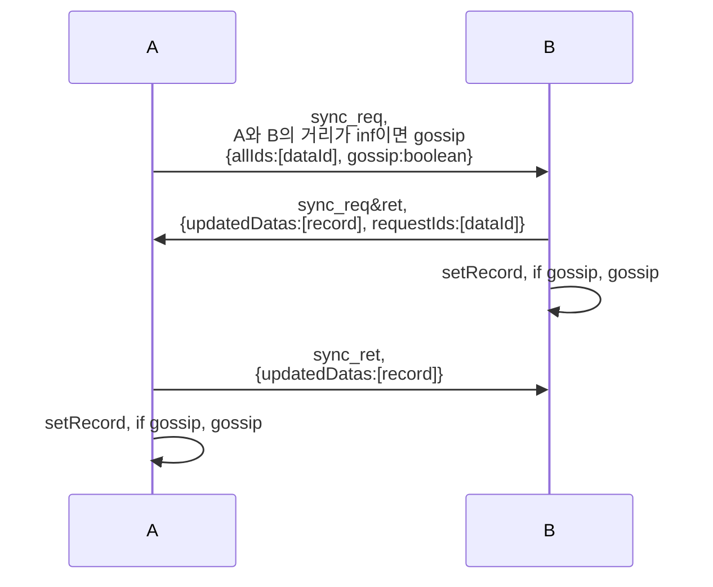
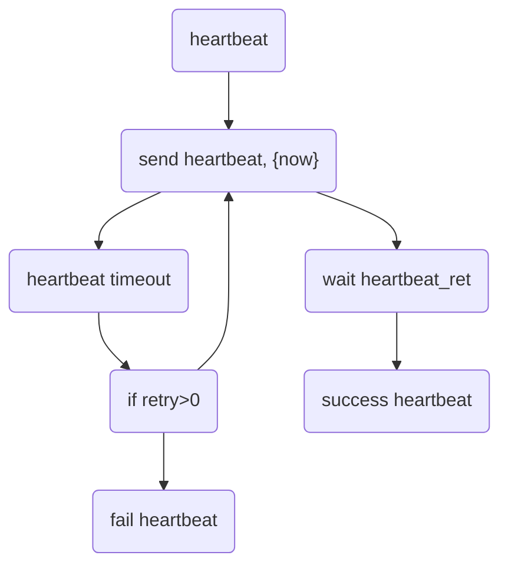
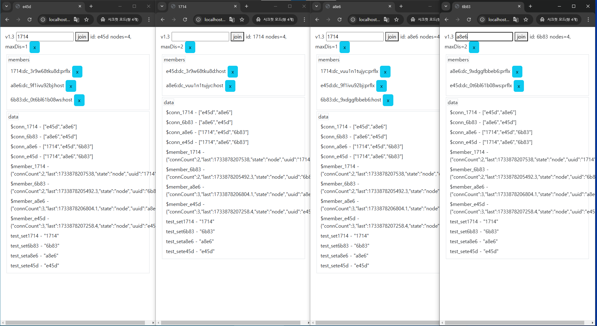
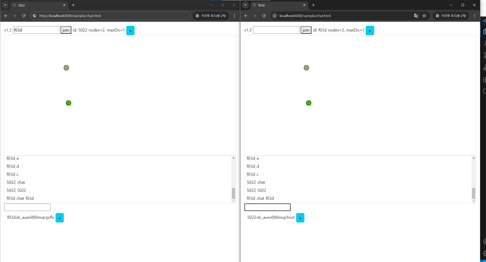

# ukvdb - unreliable key value database

etcd 또는 zookeeper 와 비슷한 웹 기반의 분산 키-값 저장소입니다  
특징으로는 더욱 믿음직스럽지 못하고 신뢰할 수 없습니다  
webrtc를 기반으로 gossip protocol을 사용합니다  
최소한의 연결로 많은 노드와 연결되는 것이 목적입니다

```
let u = await new Ukvdb().init()
u.join('id')
u.set('key', {value:"value"})
u.get('key')
u.storage.onData('key.*',(key, record)=>{})
u.members.onConnMember((type, id, member)=>{})
```

기능

1. 저장소에 $member_id, $conn_id 로 된 멤버 정보를 공유
2. 멤버 정보를 바탕으로 적절한 수준의 연결 유지
3. 데이터 변경 감지
4. 데이터 전파

### join



### set



### sync



### heartbeat





